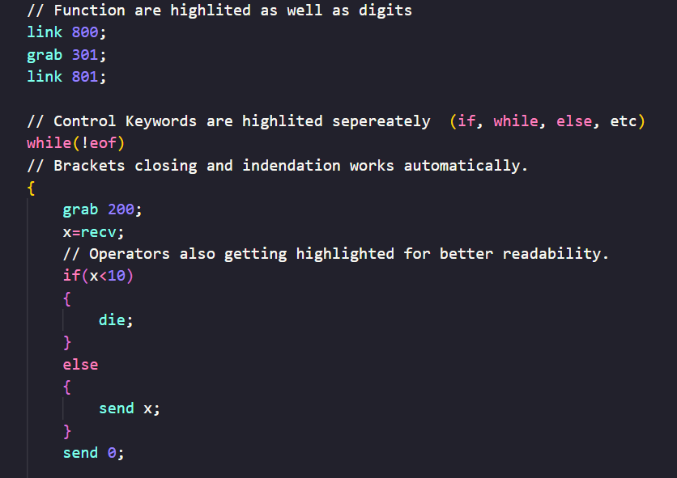

# EXA++ Syntax Highlighting

VS Code syntax highlighting and auto-brackets for the high-level language [ExaPlusPlus][exa-plus-plus] by [TesAnti][TesAnti-github].

## Installation

Hit Ctrl + Shift + P in VS Code and select 'Developer: Install from Location...' and choose the main folder of this extension. 

## Usage

After installation the following file extension will be automatically detected:
- `.expp`

For compiled .exppc files, you can use [EXA Syntax Highlighting][exa-syntax-highlighting] by [jonahsnider][jonahsnider-github], which inspired this project!

## Features

- Syntax Highlighting for all functions and operators
- Automatically closes brackets {} and ()

## About EXA and EXA++

EXA++ is a high-level language which compiles to the assembler-like language EXA from the gamm [EXAPUNKS][exapunks] by [Zachtronics].

### From the game manual

Keep in mind this is written as if it were documentation for the EXA language from the game universe:

> The EXA virtual machine (EXA-VM) allows many execution agents (EXAs) to execute in a shared network of host computers.
> Within a network, EXAs can be dynamically created, destroyed, and transferred from one host to another.
> The EXA-VM enables all EXAs to run independently and simultaneously, even when multiple EXAs are located within the same host.
> An EXA's program consists of a series of instructions. Each instruction requires zero or more operands...

## Known Issues

- Missing line-ending ";" is not yet detected.
- Comments aren´t greyed out

## ToDo - Help from the community!

It´s highly appreciated to recieve community support while improving ExaPlusPlus Syntax highlighting.
There are several things ToDo:
- Improve readability
- Detect enviornment variables #DATA, #DIAl, etc.
- Detect wrong syntax (especially forgetting ';')
- And so on...

It´s my first VS-Code Module and I just started to dive into this topic :)

## Release Notes

Beta public release.

### 0.1.0

Initial public release.

## License

Copyright 2024 Dreak

Apache License 2.0

---

[exapunks]: https://www.zachtronics.com/exapunks/
[zachtronics]: https://www.zachtronics.com/
[exa-plus-plus]: https://github.com/TesAnti/ExaPlusPlus
[TesAnti-github]: https://github.com/TesAnti
[exa-syntax-highlighting]: https://github.com/jonahsnider/exa-syntax-highlighting
[jonahsnider-github]: https://github.com/jonahsnider/